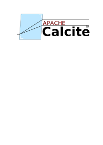
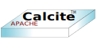
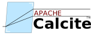
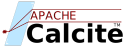

# Candidate logos for Apache Calcite

## Candidate 1A

## Candidate 1B

## Candidate 1C

## Candidate 2A

## Candidate 2B

## Candidate 2C

## Candidate 3

## Candidate 4A

## Candidate 4B

## Candidate 4C

## Candidate 4D

## Candidate 5A

## Candidate 5B

## Candidate 5C

## Candidate 5D

## Candidate 5E

## Candidate 5F

## Candidate 6A

## Candidate 6B

## Candidate 6C

## Candidate 6D

## Candidate 6E

## Candidate 6F

## Candidate 6G

